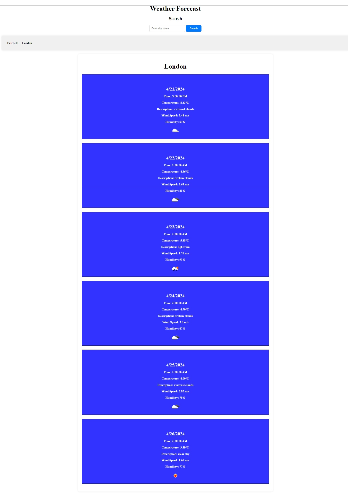

# Weather Dashboard

## Description

This weather dashboard allows users to search for a city and view current and future weather conditions. The application also keeps track of search history for easy access to previously searched cities.

## Features

Search for a city to view current and future weather conditions.
Display current weather conditions including the city name, date, weather icon, temperature, humidity, and wind speed.
Show a 5-day forecast with date, weather icon, temperature, wind speed, and humidity for the searched city.
Click on a city in the search history to view its current and future weather conditions.

## Technologies Used

HTML, CSS, JavaScript
OpenWeatherMap API for weather data
Local storage for managing search history

Installation

N/A

## Usage

Enter a city name in the search input and click the search button.
Current weather conditions and a 5-day forecast will be displayed.
The searched city is added to the search history.
Click on a city in the search history to view its weather conditions again.
Screenshots

## Credits
Matheus Almeida
Weather icons provided by OpenWeatherMap
Background image sourced from Unsplash

## License

MIT License

